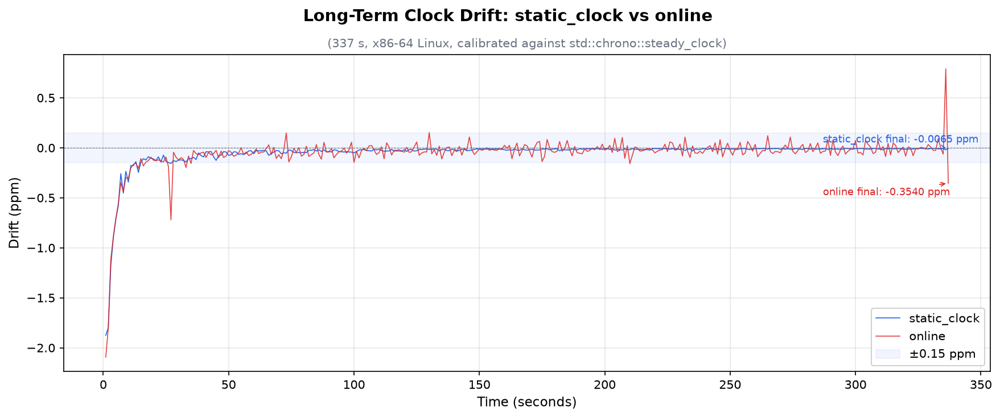

# fastant-cpp

A C++23 header-only timing library powered by the x86 Time Stamp Counter (TSC),
delivering ~2.5× faster `now()` than `std::chrono::steady_clock` with nanosecond
precision and sub-ppm long-term accuracy.

This is a port of the Rust [fastant](https://github.com/fast/fastant) crate
(originally developed for [TiKV](https://github.com/tikv/tikv)), extended with
an online-calibrated backend inspired by
[JaneStreet's `time_stamp_counter`](https://github.com/janestreet/time_stamp_counter).

## How It Works

On x86 Linux, the library reads the CPU's invariant TSC via the `RDTSC`
instruction — a single-cycle operation returning a 64-bit hardware counter that
ticks at a fixed frequency regardless of DVFS or C-states. The invariant TSC
guarantee is verified via CPUID leaf 0x80000007 EDX[8]; as an additional safety
check the kernel's current clocksource is probed via `/sys`.

TSC cycles are converted to nanoseconds using a calibrated conversion factor
`nanos_per_cycle = 1e9 / cycles_per_second`. The library exposes two backends
that differ only in **how** this factor is obtained. On non-x86 platforms, both
backends silently fall back to `std::chrono::steady_clock`.

## Backends

| Property | `static_clock` (default) | `online` |
|---|---|---|
| Calibration | Once at startup, converges to 0.001% | Continuous EWMA, ~1 Hz |
| TSC serialization | `_mm_lfence()` | None (compiler barrier only) |
| Latency (hot path) | ~7.6 ns, zero branches | ~7.0 ns, one branch + rare CAS |
| Latency jitter | None | Occasional ~1 µs spike on calibration |
| `now()` cost | `rdtsc - anchor` | `rdtsc - anchor` + cal check |
| Long-term drift | ±0.15 ppm (100 ms cal window) | ±0.15 ppm (convergent) |

**`static_clock` (recommended)** — calibrates once before `main()` by measuring
TSC increments against `steady_clock` over repeated 100 ms windows until the
estimated frequency converges to within 10 ppm. A `_mm_lfence()` fence ensures
accurate ordering between the clock read and `RDTSC`. Once calibrated,
`current_cycle()` is a single subtraction with no branches or atomic operations,
providing consistent low-latency timestamps.

**`online`** — skips the `_mm_lfence()` fence and instead calibrates
continuously using an exponentially weighted moving average (EWMA) linear
regression. Every ~1 second, `current_cycle()` feeds a new `(time, tsc)` sample
into the calibrator via a lock-free CAS. Over time this converges to the same
frequency as `static_clock`, with the benefit of automatically adapting to any
frequency drift, at the cost of occasional calibration-induced latency spikes.

## Quick Start

```cpp
#include "fastant/fastant.hpp"
#include <chrono>
#include <iostream>
#include <thread>

int main() {
    // Use the default backend (static calibration, _mm_lfence)
    auto start = fastant::static_clock::Instant::now();

    std::this_thread::sleep_for(std::chrono::milliseconds(100));

    auto elapsed = start.elapsed();
    std::cout << "Elapsed: " << elapsed.count() << " ns\n";

    // Check TSC availability
    std::cout << "TSC available: "
              << (fastant::is_tsc_available() ? "yes" : "no") << "\n";
}
```

## API

All types are in the `fastant::static_clock` and `fastant::online` namespaces.
`fastant::static_clock` is the recommended default.

### `Instant`

A point in time measured by the TSC cycle counter.

| Method | Description |
|---|---|
| `Instant::now()` | Capture the current instant |
| `elapsed()` → `std::chrono::nanoseconds` | Time elapsed since creation |
| `duration_since(earlier)` → `nanoseconds` | Saturating duration between two instants |
| `checked_duration_since(earlier)` → `optional<nanoseconds>` | Checked duration (nullopt if earlier later) |
| `checked_add(duration)` → `optional<Instant>` | Addition with overflow check |
| `checked_sub(duration)` → `optional<Instant>` | Subtraction with underflow check |
| `as_unix_nanos(anchor)` → `uint64_t` | Convert to Unix nanosecond timestamp |
| `operator<=>` | Three-way comparison |
| `operator+` / `operator-` (duration) | Arithmetic (aborts on overflow) |
| `operator-` (Instant) | Instant difference → nanoseconds (saturating) |
| `Instant::ZERO` | Zero-valued constant |

### `Anchor`

| Method | Description |
|---|---|
| `Anchor::new_anchor()` | Pair `system_clock::now()` timestamp with current TSC cycle |

### `AtomicInstant`

Lock-free atomic wrapper around `Instant`. Supports `load`, `store`, `swap`,
`fetch_max`, `fetch_min`, `into_instant`. Memory-order aware with validation.

### Free Functions

| Function | Description |
|---|---|
| `fastant::is_tsc_available()` | Whether TSC acceleration is active (static_clock backend status) |

## Platform Support

| Platform | Timer | Resolution |
|---|---|---|
| Linux x86-64 | Time Stamp Counter (TSC) | ~0.26 ns / cycle |
| Other platforms | `std::chrono::steady_clock` | OS-dependent (~ns) |

## Requirements

- **C++23** compiler (GCC ≥ 14, Clang ≥ 19)
- **CMake** ≥ 3.21
- x86-64 CPU with invariant TSC for hardware acceleration (falls back gracefully otherwise)

## Building

```bash
# Header-only — just add the include path
cmake -B build && cmake --build build

# With tests (requires Catch2, fetched automatically)
cmake -B build -DFASTANT_BUILD_TESTS=ON
cmake --build build && ctest --test-dir build

# With benchmarks (requires Google Benchmark, fetched automatically)
cmake -B build -DFASTANT_BUILD_BENCHMARKS=ON
cmake --build build && ./build/bench/bench_instant

# With examples
cmake -B build -DFASTANT_BUILD_EXAMPLES=ON
cmake --build build
```

## Performance

Measured on x86-64 Linux (AMD Ryzen, ~3.75 GHz), GCC 14:

```
BM_StaticInstantNow       7.6 ns   (static_clock, _mm_lfence + rdtsc)
BM_OnlineInstantNow       7.0 ns   (online, rdtsc only)
BM_InstantNowSteadyClock  18.9 ns  (std::chrono::steady_clock)
BM_AnchorNew              23.5 ns  (system_clock + rdtsc)
```

## Long-Term Drift

337-second drift test comparing both backends against `std::chrono::steady_clock`
on x86-64 Linux (100 ms static calibration window):



Full data available in [`longterm.txt`](longterm.txt). Both backends converge
to the same `nanos_per_cycle` value (~0.263649), confirming they estimate the
same hardware frequency. The `static_clock` backend stabilizes at ±0.15 ppm
after initial convergence, while `online` tracks the same frequency with
occasional calibration-induced jitter.

## License

Apache 2.0 — see [LICENSE](./LICENSE)
